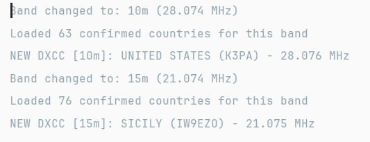
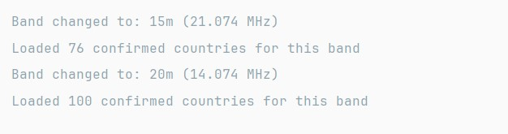
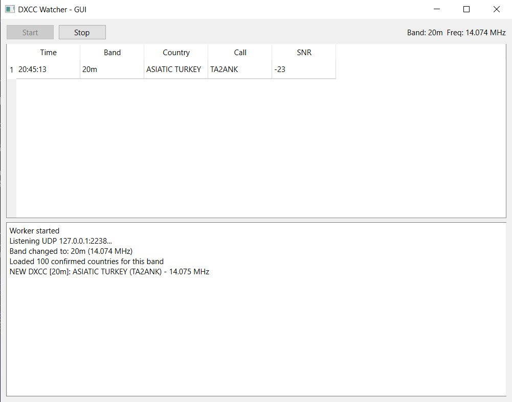

# DXCallAlert

A Python tool that monitors WSJT-X UDP packets and alerts you when a new DXCC entity is decoded that you haven't confirmed yet.
Features

Listens to WSJT-X UDP broadcast messages in real-time
Extracts callsigns from decoded messages
Identifies DXCC entities using CTY.DAT country files
Tracks confirmed countries to avoid duplicate alerts
Sends Windows notifications for new DXCC entities
Displays callsign, country, mode, and SNR information

## Screenshots:






## Requirements

Python 3.6+
WSJT-X configured to send UDP packets

Installation

Clone this repository:
```
git clone https://github.com/I3rixon/DXCallAllert.git
cd DXCallAllert
```
Install required dependencies (if any additional packages are needed)
Configure your settings in config.py:
```
UDP_IP = "127.0.0.1"          # IP to listen on
UDP_PORT = 2237               # WSJT-X UDP port (default: 2237)
CTY_FILE = "cty.dat"          # Path to CTY.DAT file
CONFIRMED_FILE = "confirmed.txt"  # Path to confirmed countries list
```

## Configuration

### WSJT-X Setup

1. Open WSJT-X
2. Go to **File → Settings → Reporting**
3. Enable **UDP Server**
4. Set the port to match `UDP_PORT` in your config (default: 2237)

### Confirmed Countries File

Create a `confirmed.txt` file with one country name per line for entities you've already confirmed:
```
United States
Germany
Japan
CTY.DAT File
Download a CTY.DAT file from Country Files and place it in your project directory, or update CTY_FILE path in config.
Usage
Run the script:
python main.py
```

The program will:
- Load your confirmed DXCC entities
- Start listening for WSJT-X UDP packets
- Display new DXCC entities in the console
- Send Windows notifications when new entities are detected

Press `Ctrl+C` to stop.

## Project Structure
```
DXCallAllert/
│
├── main.py
├── config.py
│
├── wsjtx/
│   ├── __init__.py
│   ├── udp_listener.py
│   ├── decoder.py
│
├── dxcc/
│   ├── __init__.py
│   ├── cty_parser.py
│   ├── callsign.py
│
├── notify/
│   ├── __init__.py
│   └── windows.py
│
├── data/
│   ├── cty.dat
│   └── confirmed_countries.txt
│
└── requirements.txt
```

## Example Output
```
Listening UDP 127.0.0.1:2238...
NEW DXCC: UNITED STATES (WW3S)
NEW DXCC: ST. LUCIA (J69DS)
```

## License

MIT License